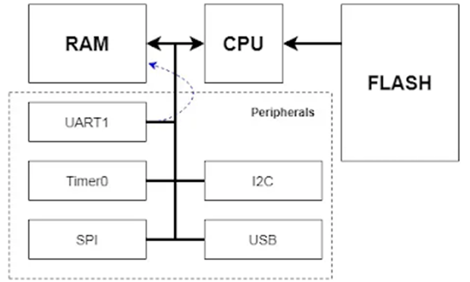

# DMA

# CONCEPTS

- Direct Memory Access: is a process of transferring data without direct involvement of the processor.

# OPERATIONS

## Normal CPU operations

4 steps operations involves CPU

1. CPU starts at the program address on FLASH, and reads the instructions there. 
2. CPU reads data from (or send data to) peripherals, UARTs, Timers, GPIOs, communication ports, coming from peripherals bus. 
3. CPU writes variable to RAM, performs calculations on RAM. 
4. CPU reads data from RAM via memory bus.



## DMA operations


- The following steps are done to send data using DMA Controller:
1. CPU config and starts DMA Controller
2. Peripherals request DMA to send/receive data from peripherals.
3. DMA performs requests. DMA becomes the master that can control the BUS, and send/receive data from **SRAM** memory 
    1. Case 1: peripheral requests data
        1. DMA receives requests from Peripherals.
        2. DMA requests data from SRAM ⇒ SRAM sends data to peripherals. The Data is routed directly to peripherals on BUS.
    2. Case 2: data is received from peripheral 
        1. DMA receives requests from Peripherals.
        2. DMA requests data from Peripherals ⇒ Peripherals sends data to SRAM. the Data is routed directly to SRAM on BUS.
4. DMA raises interrupt and inform CPU of data transferring completion. 
- DMA configurations:
    - 2 DMA controllers DMA1 has 7 channels, DMA2 has 5 channels.
    - The channels can only support certain peripherals, and cannot operate at the same time, meaning DMA1 cannot run 2 channels at the same time.
    - The channels has different priorities.
    - DMA informs CPU via interrupts. There are 5 interrupt flags: DMA Half Transfer, DMA Transfer complete, DMA Transfer Error, DMA FIFO Error, Direct Mode Error
        
        
        
- DMA has 2 operation modes:
    - normal: DMA stops after sending data and reaches a buffer limit
    - circular: DMA runs continuosly.

# IMPLEMENTATION

- Configure clocks for DMA, GPIO, SPI etc all the entities that work in data transferring.

```c
void RCC_Config(){
	RCC_APB2PeripheralClockCmd(RCC-APB2Periph_GPIOA | RCC_APB2Periph_SPI1, ENABLE);    // check diagram: GPIOA uses APB busline
	RCC_AHBPeriphClockCmd(RCC_AHBPeriph_DMA1, ENABLE);       // check diagram: DMA1 will use AHB busline. 
}
```

- Configure peripherals

```c
#define SPI1_GPIO GPIOA
void GPIO_Config(){
	GPIO_InitTypeDef GPIO_InitStructure;
  GPIO_InitStructure.GPIO_Speed = GPIO_Speed_50MHz;
  GPIO_InitStructure.GPIO_Mode  = GPIO_Mode_AF_PP;
  GPIO_Init(SPI1_GPIO, &GPIO_InitStructure);		
}

void SPI_Config(){                               // this is slave config (we receives data from SPI, SPI is receiving data from external source)
	SPI_InitTypeDef SPI_InitStruct;
	SPI_InitStruct.SPI_Mode  = SPI_Mode_Slave;
	SPI_InitStruct.SPI_Direction = 
	SPI_InitStruct.SPI_CPOL = SPI_CPOL_Low;        // clock polarity
	SPI_InitStruct.SPI_CPHA = SPI_CPHA_1EDGE;      // clock phase, data is sampled on the falling edge.
	SPI_InitStruct.SPI_DataSize = SPI_DataSize_8b;
	SPI_InitStruct.SPI_FirstBit = SPI_FirstBit_MSB;
	SPI_InitStruct.SPI_CRCPolynomial = 7;
	SPI_InitStruct.SPI_NSS  = SPI_NSS_Hard;  
	
 	SPI_Init(SPI1, &SPI_InitStruct);
 	SPI_Cmd(SPI1, ENABLE);
}
```

- Configure DMA: in the following we configure DMA to READ from SPI1. Thus the SPI1 has be configured as slave and the DMA channel to be used must accomodate the SPI1_RX

```c
#define DMA_DIR_PeripheralSRC ((uint32_t)) 0x00000010;             // defined in stm32 header file for the MCU
uint8_t buffer[100]; 
void DMA_Config(){
	DMA_InitTypeDef DMA_InitStruct;
	DMA_InitStruct.DMA_Mode = DMA_Mode_Normal;
	DMA_InitStruct.DMA_DIR = DMA_DIR_PeripheralSRC;                   // data from Peripheral as source, the address of peripheral is defined in stm32... header file.
	DMA_InitStruct.DMA_M2M = DMA_M2M_Disable;
	DMA_InitStruct.DMA_BufferSize = 35;
	// config how DMA writes to SRAM:
	DMA_InitStruct.DMA_MemoryBaseAddr = (uint32_t)buffer;             // address on the SRAM to write to, or address of the first item of the buffer array defined above. 
	DMA_InitStruct.DMA_MemoryDataSize = DMA_MemoryDataSize_Byte;
	DMA_InitStruct.DMA_MemoryInc = DMA_MemoryInc_Enable;              // increase the address on SRAM or not. ENABLE will write to next item of the buffer array defined above.
	// config how DMA reads from Peripheral
	DMA_InitStruct.DMA_PeripheralBaseAddr = (uint32_t)&SPI1->DR;      // DR is where the SPI stores data that should be sent to DMA
	DMA_InitStruct.DMA_PeripheralDataSize = DMA_PeripheralDataSize_Byte;
	DMA_InitStruct.DMA_PeripheralInc = DMA_PeripheralInc_Disable;     // Should alway be disable because we want to read data from DR, not SR or anything else.
	DMA_InitStruct.DMA_Priority = DMA_Priority_Medium;
	
	DMA_Init(DMA1_Channel2, &DMA_InitStruct);         
  DMA_Cmd(DMA1_Channel2, ENABLE);
  // Start the DMA to handle request
  SPI_I2S_DMACmd(SPI1, SPI_I2S_DMAReq_Rx, ENABLE);                  // has to use correct channel for receiving data from SPI1_RX
																																		// the value is in header file for the MCU						  
}
```

- Run data transferring. Note that since the DMA handles data transferring, we could perform other logic in while loop.

```c
int main(){
	RCC_Config();
	GPIO_Config();
	DMA_Config();
	SPI_Config();
	while(1) {
		// main logic
	}
}
```

# Q&A