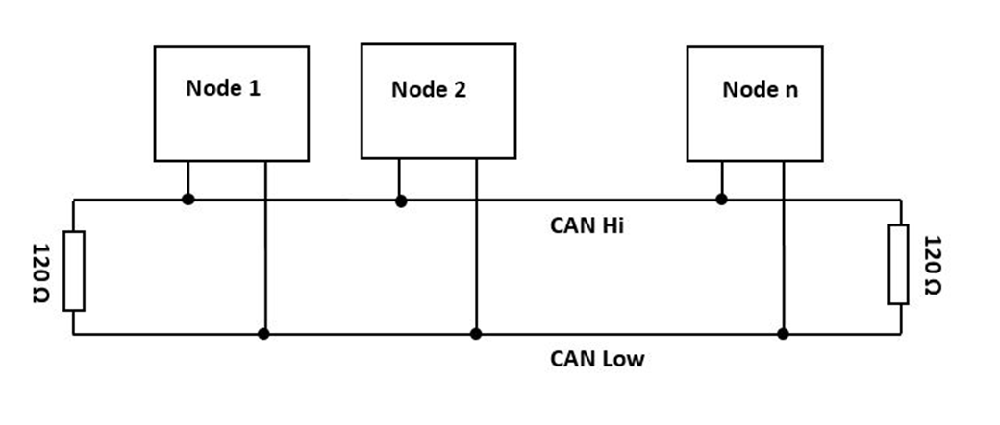

# CAN

# What is CAN?

- originally developed as form of networking method that provides the communication path between various electronic devices (ECU) such as the communication path between engine management system, gear control, light control, air bags, air conditioning, central locking and an automobile embedded system
- CAN now is applied not only in automotive field but also in IoT, medical equipment, electrical train, industrial automation etc and other RTOS applications
- **ISO-11898: 2003**  defines CAN communication protocol.
- **Why CAN?:**
    - Save BUS line. There is no need for master, support multiple peers connected together.
    - Higher speed than SPI, UART.
    - Ability to add new nodes without affecting operations of other nodes.

## CAN Network Topology:

- Electrical devices, Nodes, are connected on a single bus line in parallel.
- The bus line comprises of 2 lines: CAN-High and CAN-Low, separated by two 120 Ohm resistors which acts as Bus Terminator.
    - The Bus Terminator function is to mimic the impedance of the network cable to stop the signal at the end of the line. The Bus terminator has impedance match that of the bus cable. I absorb the signal when it reaches the end of the cable, preventing signal bounce, or signal reflection.
    
    
    
- Each CAN Node has:
    - CAN Transceiver:
        - converts binary signal to 2 differential electrical signals to be transmitted on CAN_H and CAN_L
    - CAN Controller
        - accepts incoming CAN message, read arbitration/header, forward data load to MCU.
        - performs error checking and re-send message.
        - interface with MCU.
    - Microcontroller (MCU)
        - decide when to send out CAN msg.
        - performs logic required to construct CAN message or handles/interprets CAN message.
        - can reset Node if there is error on Bus.

## CAN in OSI layer:

- CAN includes both Layer2 and Layer1
    - Physical layer: responsible for the transmission of raw data. It defines the specifications for the parameters such as voltage level, timing, data rates, and connector.
    - Datalink layer: The following tasks are done:
        - Message filtering
        - Message and status handling
        - Message framing
        - Transfer rate and timing
        - Arbitration
        - Acknowledgement
        - Message validation
        - Error detection and Signaling
        - Fault confinement

# CAN FD

**Standard CAN vs CAN FD**

|  | CAN FD | CAN |
| --- | --- | --- |
| Data Rate | ≤8Mbps | ≤1Mbps |
| Payload size | 64 bytes | 8 bytes |
| CRC length | 17 or 21 bits | 15 bits |
| Bit rate flexibility | Dual (arbitration/header + data phases) | Fixed |
| Error detection | Enhanced CRC | basic CRC |
| What determines dominant/recessive | Dominance: Voltage difference: 1.5-2 volts | Dominance: Voltage difference: 1.5-2 volts |

[Physical Operation of CAN](Physical%20Operation%20of%20CAN%2015ae19aaf59580098d2adc0d942c843c.md)

[CAN Layer 2 operation ](CAN%20Layer%202%20operation%2015ae19aaf59580d69703fa93a8b48fb2.md)

# Q&A:

1. How to distinguish adjacent bits? 

1. How does a Node know when it should expect an ACK? How does a node knows a node far away the time it needs to send data to a second node?

1. Why do we need 7 bits recessive on EOF?