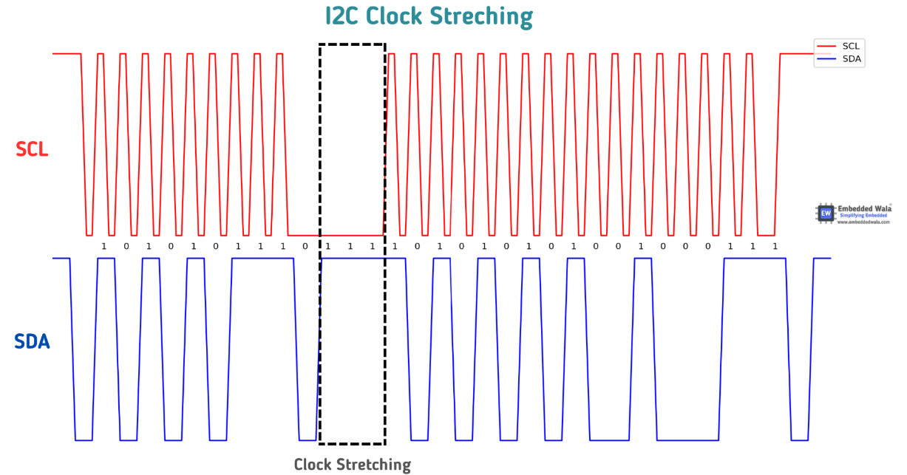

# Interview questions:

# Embedded system questions

1. what is clock stretching?
    - I2C devices can slow down communication by *stretching* SCL: During an *SCL low phase*, any I2C device, master or slave, on the bus may additionally hold down SCL to prevent it from rising again, enabling it to slow down the SCL clock rate or to stop I2C communication for a while. [1]
    - clock stretching can only be done after ACK bit.
    - clock stretching is done by holding the SCL low, and SDA high. If the slave does this, the master should be programmed to detect this condition and waits for the slave device to release the clock signal before continuing with the communication. If the master device does not detect the clock stretching condition, it may continue to transmit data, leading to **communication errors** or **data loss**. [2]
    
    
    
    [1] [Clock, Stretching, Arbitration - I2C Bus](https://www.i2c-bus.org/i2c-primer/clock-generation-stretching-arbitration/)
    
    [2] [Getting Started with I2C: What is Clock Stretching | Embedded Wala](https://embeddedwala.com/Blogs/DigitalCommunication/Getting-Started-with-I2C:-What-is-Clock-Stretching)
    
2. Explain arbitration in SPI
- SPI allows multi masters multi slaves. While the master can control which slaves to read/write data, the master cannot control other masters. If the masters transmit at the same time, there are conflict on the SDA line.
- Key to understand SPI arbitration str:
    - the starting condition: is that the SDA line goes low before the SCL.
    - masters can simulateneous assert the start condition to transmit but it must monitor the SDA : If any master sees that the state of the SDA line differs, and what is it driving, then they will exit from the communication and lose their arbitration
    
    
    

[3] [I2C Communication Protocol, Bus and Interface - Aticleworld](https://aticleworld.com/i2c-bus-protocol-and-interface/)

[4] [What is the I2C Communication Protocol? | CircuitBread](https://www.circuitbread.com/tutorials/what-is-the-i2c-communication-protocol)

3. what is clock polarity
    - In SPI, clock polarity (CPOL) and clock phase (CHPA)  indicates how the slave sampled data: at rising edge, falling edge.
    - CPOL  is the idle state of the SCL line. if CPOL is configured such that SCL is high during idle state , then CPOL = 1.
    - CPOL and SHPA are fields or properties on the HAL struct that defines the configuration of SPI
    
    ```cpp
    SPI_HandleTypeDef hspi1; 
    /* SPI1 init function */ 
    void MX_SPI1_Init(void) { 
       hspi1.Instance = SPI1; 
       hspi1.Init.Mode = SPI_MODE_MASTER; 
       hspi1.Init.Direction = SPI_DIRECTION_2LINES; 
       hspi1.Init.DataSize = SPI_DATASIZE_8BIT; 
       hspi1.Init.CLKPolarity = SPI_POLARITY_HIGH; // CPOL=1 
    	 hspi1.Init.CLKPhase = SPI_PHASE_2EDGE;      // CPHA=1
       if (HAL_SPI_Init(&hspi1) != HAL_OK) { 
    	   Error_Handler();
    }
    ```
    
4. Explain Pull up/Pull down resistor
    1. **Reason 1**: all bus lines SDA and SCA to be high when no device pull them low. Ensure proper logic.
        - The Resistors values should be around 4.7 kOhms. One side provides voltage of 5V.  The other side across the resistors are the bus lines SDA and SCA.
        - In each device, on ***each*** pin, there is drive line low logic gate and a diode line to receive data. This is called ***open drive low configuration.*** When there is no communication, electricity flows from Vdd to Pull up resistor to Drive line Low. Thus the line voltage is high.
        - When there is no communication (idle state), SDA and SCL must be high, the pull up resistor ensures such condition by ????
        - The device accepts signal from SDA, SCL which could be Voltage High or Voltage Low. The pull up resistor ensure that device can pull the lines low/high by ????
    
    Open Drive Low Pin Configuration 
    
    
    
     
    
    
    
    b. **Reason 2**: ensure proper rise time.
    
    - Resistor has capacitance characteristics. High resistance will cause longer rise time and thus bad logic.
    - The max resistance is calculated from resistor’s capacitance while the min resistance is calculated from the maximum input low voltage that the devices can tolerate.
      
5. Explain power and communication trade-off in using pull-up/ pull-down resistor:
    - the logic on SPI are determine by high and low voltage. However the voltage has rise time and fall time, which constitutes delay. The rise time and fall time are the time when the voltage goes from low to high or vice versa.,
    - fast switching is dependent on capacitance. and resistance:
        
         
        
        
        
    
    from the formular we see that V(t) is inversely proportional to Vmax(e^(-t/RC)). 
    
    - pull-up resistors with resistance lower than 4.7 kΩ are suggested ⇒ more current, V(t) rise faster. At the same time, power also increases. [5]
    
    [5] [What is the I2C Communication Protocol? | CircuitBread](https://www.circuitbread.com/tutorials/what-is-the-i2c-communication-protocol) 
    
6. Explain the differences between exception and interrupt in embedded system 
    
    Both are similar that they occurs after certain events and stop the normal flow of the program. After the interrupts or exception are handled, the program goes back to the saved stack pointer address and continue. 
    
    Exception are triggered by: 
    
    - user programmed exception: defined by zero, or when certain logic/scenarios happens
    - system call such as I/O exception, sigsegv, sigbus, etc.
    
    Interrupt are triggered by:
    
    - peripherals, such as data arrival on UART, SPI, I2C. It is similar to exception.
    
    Interrupt has priority and interrupt function is accessed by interrupt vector. Therefore, we have to: 
    
    - configure interrupt vector.
    - program the logic for interrupt handler.
    
    We defined interrupt when we need to specified **priority**. It is especially important when the MCU may need to handle multiple interrupts.
    
7. Explain the differences between interrupt and system calls
    - system call for error events has the highest priority and always occurs ⇒ we can simply define how to handle the event with exception.
    - for I/O events, we want to use interrupt as we want to specify the priority.
      
8. Explain how to config interrupt
    
    For example, if we want to define the interrupt when certain data arrived at GPIO, we have to: 
    
    1. identify the GPIO port and its corresponding function, its interrupt line.
    2. configure the clock for the peripheral
    3. configure the GPIO functionality
    4. configure the SPI/I2C/UART functionality
    5. configure the interrupt vector which should have the address of the interrupt function and priority.
    6. program the interrupt handler function. The interrupt handler function should have the same address of the one defined by HAL, on interrupt vector table. 
    
    For each step, we specify the attributes of the corresponding struct provided by the HAL. 
    

# Basic C questions

1. explain the size of the struct:

```jsx
struct a { 
	uint8_t x; // 1 byte 
	uint32_t y; // 4 bytes u
	int8_t z; // 1 byte 
	uint32_t k; // 4 bytes
	}
```

1. Explain 4 type of data classes:

```c
static
extern
auto
register
```

1. Explain keyword `volatile`  `inline` `extern` 
2. List types of state machine:
    - Finite state machine
    - Moore machine
    - Mealy machine
    - Turing machine
3. Explain the differences of 

```jsx
char *str1 = "\n"
char str2  = '\n'
char str3  = "\n"
```

1. Different between macro and inline? Find the bugs in the following: 

```c
volatile unint32_t g_counter = 0;

void delay_ms(uint32_t ms){
	g_counter = ms;
	while (g_counter >0) {
		g-counter--;
		}
}

void TIMER0_IRQHandler(void) {
	static uint32_t tick = 0;
	tick++;
}
```

1. Fully explain the issues of the following codes (Nashtech)

```c
#include <iostream>
using namespace std;

char*  myFunct(char * src, char *dsc) {
    for (; *src != '\0'; src++, dsc++ ) {   
        dsc = src + 1; 
        cout<<dsc<<endl;
    }
    return dsc;
}

int main() {
    char s[] = "abcefgh11111";
    // cout<<sizeof(s)<<endl;
    // char d[sizeof(s)]   ;
    char d[10];
    char *a = s;
    myFunct(s, d);     
    cout << a << endl;
    cout << d << endl; 
    cout << s << endl; 
}
```

1. improve the following codes: (FPT)

```cpp
#include <stdio.h>

void swap(int a, int b) {
    int c = *a;
    a = b;
    *b = c;
}

int main()
{
    int a='A',b='B';
    swap(&a, &b);
    printf("a=%c b=%c", a, b);
    return 0;
}
```
