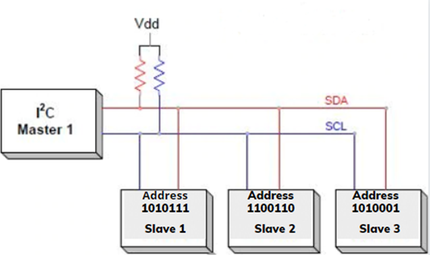

# I2C (Inter Integrated Circuit)

# Concept

- Series communication: a stream of input, 8 bits data type, are transmitted from Tx to Rx.
- Synchronized between Tx and Rx. Both use the same clock signal on SCL line.
- **Half duplex:** SDA bus line can only have Tx or Rx.
- *Multiple Masters* can communicate to multiple Slaves on the same bus line.
- 2 ports: **SCL** (clock) and **SDA** (data) ****

# Operations

1. **Start condition:** to configure Slave to receive or send data,
    1. Idle mode: both SCL and SDA are *high*. *To start transmitting*: SDA goes low before SCL.
    
    
    
      b.   To know which Slave is communicating: address must be configured for each slave. Data will be *broadcasted to all slave, but the slave will only accept data sent to its address.*
    
      c.   Transmission of data starts with broadcasting 7 bit address and R/W bit. R/W bit = 0: 
    
    master is requesting data. R/W bit = 1: master is sending data. Consequently I2C is half duplex.
    
2. **Stop condition**: transmission is stopped when SCL goes 1 before SDA, after the last 8th bit is transmitted.
3. **Synchronize bits between Master and Slave**: clock is provided by Master; *1 bit is transmitted per 1 period of SCL*.
    - Clock synchronization in I2C is maintained through a combination of the clock signal and the ACK/NACK bits. The master device generates the clock signal and controls the timing of data transfer, while the slave devices respond to the clock signal and send ACK or NACK bits to indicate successful or failed data transfer.
    - Multiple Masters on the bus means that there can be more than one device trying to claim the bus at the same time ⇒ arbitration determines which Master will claim the bus.
4. **Data Sample mode**: **Read on Rising Edge, b**oth the master and slave devices read the data bits on the rising edge of the clock, ensuring synchronization between the devices.
5. **Data format:** data is sent by frames of **9** bits: 8 bits of data or address and 1 bit Ack/Nack.
6. **Basic Data Transmission:** 
    1. data is only sent/read by the Slave after transmission of address is successful.
    2. data is left shifted and transmitted bit by bit. 
    3. data is sent by frames of **9** bits: 8 bits of data and 1 bit Ack/Nack.
    4. ACK/NACK bit is sent by RX by setting SDA = 0 after 7 bit of the frame is received. TX can send or resend after a NACK.
        1. both SDA and SLC are controlled by the Master. So if RX is the Slave, how can it write the SDA?

1. **Reading/Write indication using repeated Start Condition**:
    1. in the address frame, after the 7 left most bits for addressing, there is R/W bit that indicates if the master is requesting data or not. After the addressing frame, the following data frame will sent either by Master (Write mode) or Slave (Read mode)
    2. In order to switch between R/W, a Stop and then new Start condition must initiate. An address frame must be sent.
    
    The blue bit on SDA indicate Write/Read mode:
    

# Configuration and Implementation

1. **Configuration**:
    
    sddsaf
    
    baud rate configuration
    
2. **Transmission function**:
3. **Receiving function**:
4. **Advance configuration**:
    1. **Clock stretching** is a feature of I2C that allows a slave device to hold the clock line low to slow down the data transfer rate. This can be used by the slave device to prevent the master from sending data too quickly, giving the slave device more time to process the data. The master device must wait for the clock line to go high again before continuing the communication
        1. How It Works:
            
            **Clock Line (SCL)**: In I2C communication, the master device generates the clock signal on the SCL line.
            
            **Holding SCL Low**: If a slave device needs more time, it can hold the SCL line low, effectively pausing the communication.
            
            **Master's Role**: The master device must detect this condition and wait until the SCL line goes high again before continuing.
            

# Q&A

1. Both SDA and SLC are controlled by the Master. So if RX is the Slave, how can it write the SDA?
    1. R/W mode is controlled by Master. The R/W bit is the last bit that indicate the data frame is to be transmitted by Master or Slave. If the data frame(first 8 bits) are transmitted by Master then the following ACK/NACK bit can be transmitted by Slave.
2. Does I2C also sample data on rising edge or falling edge of SCL? Rising edge.
3. How long is a frame in I2C transmission? **9** bits 
4. What application of I2C? What concerns? 
    - used on board, mostly used on sensor.
    - the sensor if legit will have distinct sensor ID and address. We can test the sensor if it is legit by sending a request including address+ command. The sensor has to reply with sensor ID, data and checksum. The reply format could be looked up in datasheet.
5. Advantage and Disadvantage of I2C:
    - **Pros**:
        - Moderate speed, suitable for sensor setup, ideal for multiple devices.
        - **Clock stretching** allows a slave device to hold the clock line low to pause communication temporarily.
        - Multiple clock speed mode such as standard mode, fast mode, and high-speed mode.
    - **Cons**:
        - Common issues with I2C include noise and signal integrity issues, addressing conflicts, and clock synchronization problems.
        - Multiple devices can use I2C bus lines, If two or more devices try to communicate at the same time, a conflict can occur. Need to implement mechanism for different device to take priority on bus line. **Bus arbitration** is the process by which multiple devices on an I2C bus compete for control of the bus.  The I2C bus has a built-in arbitration mechanism to resolve these conflicts and ensure that only one device is communicating on the bus at any given time [1]
6. What are the reasons for the pull up resistors? 
    1. **Reason 1**: all bus lines SDA and SCA to be high when no device pull them low. Ensure proper logic.
        - The Resistors values should be around 4.7 kOhms. One side provides voltage of 5V.  The other side across the resistors are the bus lines SDA and SCA.
        - In each device, on ***each*** pin, there is drive line low logic gate and a diode line to receive data. This is called ***open drive low configuration.*** When there is no communication, electricity flows from Vdd to Pull up resistor to Drive line Low. Thus the line voltage is high.
        - When there is no communication (idle state), SDA and SCL must be high, the pull up resistor ensures such condition by ????
        - The device accepts signal from SDA, SCL which could be Voltage High or Voltage Low. The pull up resistor ensure that device can pull the lines low/high by ????
    
    Open Drive Low Pin Configuration 
    
    
    
     
    
    
    
    b. **Reason 2**: ensure proper rise time.
    
    - Resistor has capacitance characteristics. High resistance will cause longer rise time and thus bad logic.
    - The max resistance is calculated from resistor’s capacitance while the min resistance is calculated from the maximum input low voltage that the devices can tolerate.
7. What happens when 2 slave are configured with same address? 
8. Do we have start bit , stop bit in I2C? 
9. 

# References:

[1] LinkedIn Anis Hassen

[2] [Understanding the I2C Bus](https://www.ti.com/lit/an/slva704/slva704.pdf?ts=1733988682547&ref_url=https%253A%252F%252Fwww.google.com%252F)