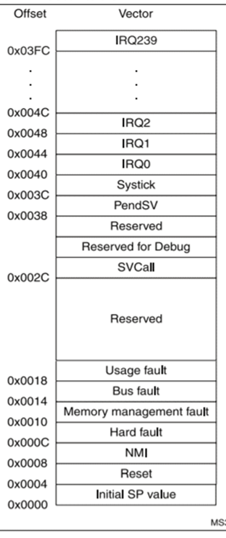

# Bootloader

# Concept

- piece of software that runs when a device is powered on. Its primary role is to initialize the hardware and load the operating system (OS) into memory so that it can start running.
- It resides in a specific area of non-volatile memory (like ROM, Flash memory, or EEPROM) so it can execute immediately after the system is powered on
- type of Bootloader:
    - **BIOS  (Basic Input/Output System)**
    - **UEFI (Unified Extensible Firmware Interface)**

# Operations

**Basic operation steps from power up** to executing `main` function:

- MCU reads value at BOOT0 and BOOT1 to know the starting address.
- The starting address to run MCU is saved to Program Counter (PC)
- Initialize the Main Stack Pointer (MSP)
- PC goes to next item `Reset`, which has *address of Reset_Handler.*
- Program goes to Reset_Handler to perform: (check /listing/Flash2.map for source codes of Reset_Handler)
    - initialize the system
    - copy variables from flash to RAM
    - execute `main()`   (the main in the Reset_Handler)



**reset procedure:** *the goal is to update firmware, and after that, the MCU will start running from the address of the firmware*. The bootloader program will perform the following steps after reset button is pressed on the MCU.

- goes to Initial SP value which stores default address 0x0800000
- restart MSP by getting the starting address of your program and the values stores at 0x08000000
    - the **bootloader** program that performs bootloading, configs the peripherals, gets the firmware update from OTA is at 0x08000000.
    - the firmware that we update is to be stored at 0x08008000 - the address of the current firmware on flash. After firmware update we have to set the MCU such that it starts at this address. This is done by the boot mode (combination of BOOT0 BOOT1 as explained above)
- `bootloader()` function will write `SCB_VTOR= firmware address`  so that on the next start up, the program will start at the address of the firmware.
- from the Initial SP value , go to Reset_Handler of the application, which will run the `main` of the application.


**interrupt procedure** (review)

# Implementation

```c
#define ADDR_STR_BLINK 0x08008000

void Boot() {
    // Thiết lập lại hệ thống clock
    RCC_DeInit();
    
    // Vô hiệu hóa các lỗi ngắt để tránh lỗi trong quá trình chuyển giao
    SCB->SHCSR &= ~(SCB_SHCSR_USGFAULTENA_Msk | SCB_SHCSR_BUSFAULTENA_Msk | SCB_SHCSR_MEMFAULTENA_Msk);
    
    // Cập nhật Stack Pointer (SP) từ bảng vector ngắt của chương trình chính
    __set_MSP(*(__IO uint32_t*)(ADDR_STR_BLINK));
    
    // Cập nhật thanh ghi SCB->VTOR để trỏ đến bảng vector ngắt của chương trình chính
    SCB->VTOR = ADDR_STR_BLINK;

    // Lấy địa chỉ Reset Handler của chương trình chính
    uint32_t JumpAddress = *(__IO uint32_t*)(ADDR_STR_BLINK + 4);
    
    // set reset_handler là function pointer trỏ đến địa chỉ mới
    void (*reset_handler)(void) = (void (*)(void)) JumpAddress;
    
    // Nhảy vào Reset Handler của chương trình chính --> chạy đến hàm main của application
    reset_handler();
}

int main(){
	Boot();
}
```

The bootloader program is at address 0x08000000

The firmware application after it was loaded is at address 0x08008000:


# Q&A

1. what do we actually when we erase full chip on STM32 ST_link Utility?
    
    A: We only erase the flash.