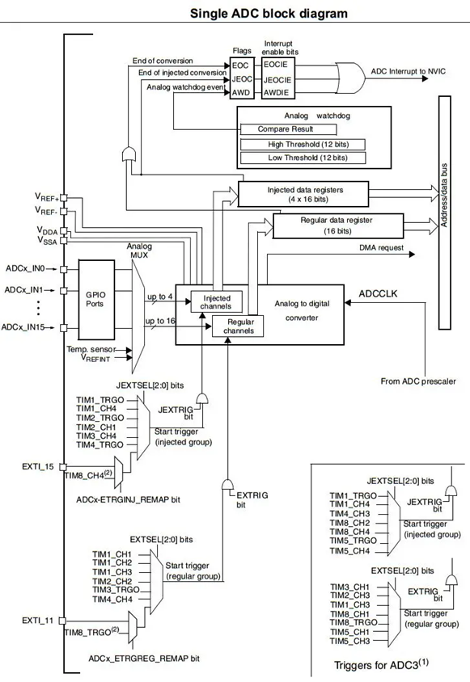

# ADC

# Concepts

- **Quantization:** Number of quantisation levels refers to the total count of discrete values or levels used to represent a continuous range of values during the quantization process.

Resolution of ADC - **(Measured in Bit). Resolution** of ADC refers to the level of detail or precision with which an analog signal is converted into a digital representation. It is not changeable, but depends on the MCU.

- **Sampling rate**: It is programmable.

# Operations



- The **sources** for ADC are from GPIO or sensor.
    - Analog mux selects the input signals from all the GPIOs.
    - 
- 2 **channels**: **injected channels** and **regular channels**.
    - **injected channels**: when there are multiple input channels, some can be configured with different priority. When there in a higher priority from injected channel, the ADC on current channel is stopped.
    - **regular channels:** support regular conversion modes:
        - single:
        - single continuous
        - scan multi channels
        - scan continuous multi-channels repeats.
- **triggers** to convert analog to digital:
    - by interrupt
    - or by channels (injected or regular)
- **outputs** are written to data registers. Depending on the channels, the data are written to injected data registers or regular data registers. The values are read by command from data bu**s.**
- **ADC clocks** are provided by ADC prescaler.

# Implementation

For example, the following convert analog voltage across variable resistor. The voltage is fed to GPIO_A port

- Configuration peripherals clock

```c
void RCC_Config(){
	RCC_APB2PeriphClockCmd(RCC_APB2Periph_GPIOA | RCC_APB2Periph_ADC1, ENABLE);
	RCC_APB1PeriphClockCmd(RCC_APB1Periph_TIM2, ENABLE);
}
```

- Configuration of GPIO port. Check the GPIO port and the ADC channels.


```c
void GPIO_Config(){
	GPIO_InitTypeDef GPIO_InitStruct;
	GPIO_InitStruct.GPIO_Mode = GPIO_Mode_AIN;
	GPIO_InitStruct.GPIO_Pin = GPIO_Pin_0;
	GPIO_InitStruct.GPIO_Speed = GPIO_Speed_50MHz;
	GPIO_Init(GPIOA, &GPIO_InitStruct);
}
```

- Configuration of ADC:
    - open file stm32f10x_ad.h to find adc definitions
    - note that some MCU use 12 bit ADC while the data bus are 16 bits. Thus we need alignment.

```c
void ADC_Config(){
	ADC_InitTypeDef ADC_InitStruct;
	
	ADC_InitStruct.ADC_Mode = ADC_Mode_Independent;
	ADC_InitStruct.ADC_NbrOfChannel = 1;
	ADC_InitStruct.ADC_ScanConvMode = DISABLE;
	ADC_InitStruct.ADC_ExternalTrigConv = ADC_ExternalTrigConv_None;
	ADC_InitStruct.ADC_ContinuousConvMode = ENABLE;
	ADC_InitStruct.ADC_DataAlign = ADC_DataAlign_Right;
	
	ADC_Init(ADC1, &ADC_InitStruct);
	ADC_RegularChannelConfig(ADC1, ADC_Channel_0, 1, ADC_SampleTime_55Cycles5);
	ADC_Cmd(ADC1, ENABLE);
	ADC_SoftwareStartConvCmd(ADC1, ENABLE);            // start the ADC, since it mode is continuous, we call this function to start ADC here. 
}

```

- to read output data from ADC:

```c
int main(){
  uint16_t val;
  uint16_t sum=0;
  uint16_t final=0;
	RCC_Config();
	GPIO_Config();
	TIM_Config();
	ADC_Config();
	while(1){
		val = ADC_GetConversionValue(ADC1)  // read adc output value from different channels in sequence.
		         // not that input from all GPIO are read. The input were already multiplexed via ADC multiplexer. 
		final = ADC_GetDualModeConversionValue();
		
	}
}
```

- to give stable output for ADC:
    - get the average per period.
    - add delay to slow the data conversion

```c
while(1){
		for(int i = 0; i < 10; i++){
			val = ADC_GetConversionValue(ADC1);
			delay_us(100);
			sum += val;
		}
		sum = sum/10;
		Delay_Ms(100);
sum = 0;
	}

```

- using **Kalman filter** to stabilize ADC output/ reduce noise:

```c

```

# QA:

1. for a single ping sensor, what ADC mode should we used? 
2. for a single gyroscope, what ADC mode should we used? 
3. if ADC is 12 bits, what is the quantization level? 
4. how to improve ADC output if the analog signal is not stable? 
5.