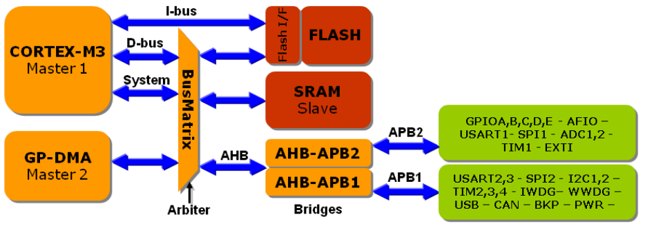

# Cortex ARM architecture

# Component



1. **Status registers**: holds information about the current state of the processor
    
    
    
    - The top five bits are the condition code flags and are aliased as the Application Program Status Register. Some instructions are only executed if the instruction condition code matches the state of the Application Program Status Register flags.
    - **Arithmetic Operations**: After performing an arithmetic operation, the CPU updates the condition flags (N, Z, C, V) based on the result.
    - **Branching**: The CPU uses condition flags to determine the outcome of conditional branch instructions. For example, it might branch to a different part of the program if the Zero Flag is set.
    - **Interrupt Handling**: The control bits in the PSR can enable or disable interrupts, allowing the CPU to prioritize certain tasks.
    - **Mode Switching**: The mode bits indicate the current operating mode of the CPU, which affects the available instructions and memory access permissions.
2. **CPU register file**:


- **Stack Pointer (R13)**: special-purpose register in a CPU that tracks the top of the stack in memory. The stack is a data structure used for managing function calls and local variables. It ensures the correct order of operations in a program by maintaining the stack's structure.
- **Program Counter (R15)**: points to next instruction to be.

```kotlin
|---------------------------|
|    PC (Program Counter)   |  --> Points to next instruction to be executed
|---------------------------|
|    0x0000  | LOAD A, 0x01 |  <-- Instruction at address 0x0000
|    0x0001  | ADD A, B     |  <-- Instruction at address 0x0001
|    0x0002  | STORE A, 0x02|  <-- Instruction at address 0x0002
|    0x0003  | JMP 0x0000   |  <-- Instruction at address 0x0003
|---------------------------|
```

- **Link register (R14)**: is used to store the return address when a call is made to a procedure. If your code calls several levels of subroutines, the compiler will automatically store R14 on the stack.
1. **Memory Map:** 
    
    
    
    
    
    - **SRAM**:
    - **FLASH (code section)** The FLASH memory region is composed of three sections
        - User FLASH memory starting at 0x0000000
            - The bootloader is designed to download code over USART1 and program it into the User FLASH memory.
            - The bootpins also allow the internal SRAM to be mirrored at 0x00000000 in place of the User FLASH
        - System Memory0 aka big information block: 4K of FLASH memory that is factory programmed with a bootloader
            - a reset the STM32 will begin to execute the bootloader rather than the application code held in the User FLASH
        - final section from 0x1FFFF800, little information block, contains a group of option bytes that allow you to configure some system settings for the STM32.
2. **Bus lines**:
3. **System timer - General purpose timer:**
4. **Peripherals**:

# Operations:

## **CPU operation modes:**

- **Thread**: can run both **Non-privilege mode and Privilege mode.**
    - **Non-privilege mode**: certain instructions are disabled. Access to most registers in the Cortex processor system control space is also disabled
    - **Privilege mode:** CPU has access to the full instruction set
- **Handler**:
    - **Privilege mode**: CPU has access to the full instruction set. Handler can only run privilege mode.

For ROTS application: the chip can be used 

- handler mode with in privileged mode and uses the main stack for advanced configuration (exceptions and the RTOS).
- Thread mode with unprivileged access and uses the process stack for application code.

⇒ This way the system code and the application code are partitioned and errors in the application code will not cause the RTOS to crash.

## **Interrupt handling**:

- The **Nested Vector Interrupt Controller (NVIC)** is a standard unit within the Cortex core. This means that all Cortex-based microcontrollers will have the same interrupt structure, regardless of manufacturer.
- NVIC


### Basic Procedure:

1. save current stack frame.
    1. Program Status Register, the program counter and the link register are saved
    2. R0 – R3, used for parameter passing, are also saved
    3. R12, intracall scratch register, is also saved
    4.  additional code generated will use R12 if it need a CPU register
    
    
    
2. the starting address of the interrupt service routine is fetched on the instruction bus. The time taken from the interrupt being raised to reaching the first instruction in the interrupt routine is just 12 cycles


1. the interrupt ends the process is reversed, the stack frame is restored automatically by microcode and in parallel the return address is fetched, so that the background code can resume execution in 12 cycles

### Multiple Interrupt handling - Tail Chaining:

- **if 2 or more interrupts are raised while no other is handled**:
    - highest priority interrupt will be handled first,
    - after that the stack frame is not restore, and the program doesn’t go back to previous stage yet.
    - lower priority interrupt will be served after.
    - there are 6 cycles delay the between 2 interrupts.
    - At the end of the pending interrupts the stack is restored and the return address is fetched, so the background code can begin execution in the standard 12 cycles


- **If the low priority interrupt arrives while the running interrupt is exiting:**
    - the stack pointer will be wound back to its original value. There is an additional 6 cycle delay while the new ISR address is fetched
    - Thus the second interrupt will need 7-12 cycles to be handled.


- **Late arrival case, higher priority interrupt comes while lower priority interrupt is *about to be* handled**:
    - If this condition occurs during the initial PUSH the NVIC will switch to serve the higher priority interrupt. The stacking continues and there will be a minimum of 6 cycles from the point at which the high priority interrupt is raised, while the new ISR address is fetched.
    - Once the high priority interrupt has finished execution, the original low priority interrupt will be tail chained and begin execution six cycles

