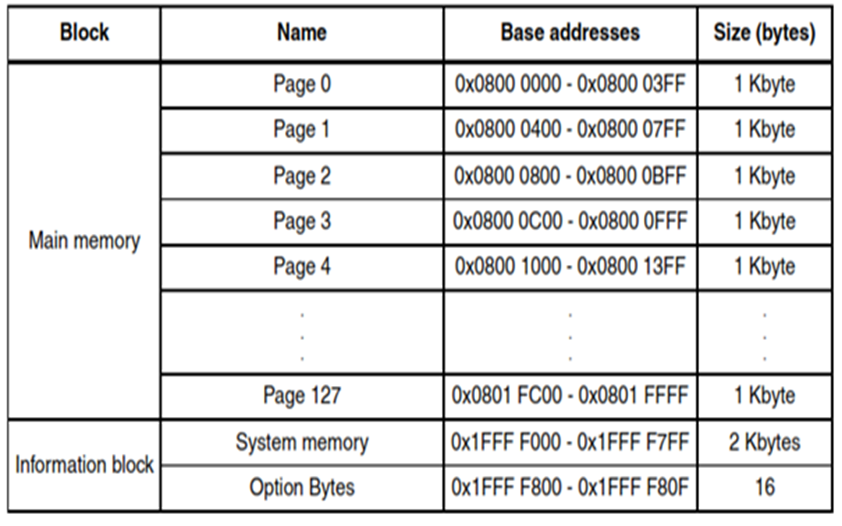

# Flash

# Concept

- Types of memory in embedded system:
    - RAM: fast and instant read/write; used to write variables that live on application
    - Flash: used to write firmware.
        - slow write/fast read;
        - write in chunks; delete whole page;
        - must delete before write;
        - persistent write/read; don’t loose memory after power down.
        - limit read/write.
    - EPROM
        - some MCUs don’t have eprom
        - write per bytes; must delete before write.
        - persistent write/read; don’t loose memory after power down.
        - limit read/write.

### Flash:

- Flash are organized as *pages* with size 1KB, and *banks* that includes many pages. Simple MCU has single bank flash, while more advance MCU has multiple bank flash.
- Must write data in “chucks”: half word (16 bits) or word (32 bits)
- Flash address starts at 0x08000000
    
    Address Range                       Description
    0x08000000 - 0x080FFFFF   Main Flash memory (1 MB)
    0x1FFF0000 - 0x1FFF77FF   System memory (30 KB)
    0x1FFF7800 - 0x1FFF7A0F   Option bytes
    0x1FFF7A10 - 0x1FFF7A13   Reserved
    0x1FFF7A14 - 0x1FFF7B7F   System memory (continued)
    0x1FFF7B80 - 0x1FFF7FDF   Reserved
    0x1FFF7FE0 - 0x1FFF7FFF   Option bytes (continued)
    0x1FFF8000 - 0x1FFF9FFF   Reserved
    0x1FFFA000 - 0x1FFFABFF   System memory (continued)
    0x1FFFAC00 - 0x1FFFAFFF   Option bytes (continued)
    0x1FFFB000 - 0x1FFFDFFF   Reserved
    0x1FFFE000 - 0x1FFFF7FF   System memory (continued)
    0x1FFFF800 - 0x1FFFFCFF   Option bytes (continued)
    0x1FFFFD00 - 0x1FFFFD13   Reserved
    0x1FFFFD14 - 0x1FFFFFBF   System memory (continued)
    0x1FFFFFC0 - 0x1FFFFFFF   Option bytes (continued)
    0x20000000 - 0x2001FFFF   SRAM (128 KB)
    0x40000000 - 0x40023FFF   Peripheral registers
    



- Flash as part of the whole memory map:


- The flash memory map is defined in `F[lash2.](http://flash2.map)map` file, it basically defines a vector a table.
- The bootloader, the default program that listens to updated coming from UART and user application in hex are to be stored in the Flash:
    - boot mode allows running the MCU from specific address after resetting MCU.
    - System memory is default bootloader program from producer that loads up UART, I2C, SPI, etc. To load new program to the MCU, we have to use this boot mode.
    - To run the application that we write, we need to use main flash memory, which starts at 0x08000000, and has the default program + the program written by us.
    
    
    
    
    

# Operations

- **Flash delete procedure**:


# Implementation:

1. Delete page:
    
    ```c
    void Flash_Erase(uint32_t addresspage){
    	FLASH_Unlock();
    	while(FLASH_GetFlagStatus(FLASH_FLAG_BSY) == 1);
    	FLASH->CR |= FLASH_CR_PER;                        // enable delete page           
    	FLASH->AR  = pageAddress;
    	FLASH->CR |= FLASH_CR_STRT;                       // start to delete page
    	while(FLASH_GetFlagStatus(FLASH_FLAG_BSY) == 1);  // wait till deleting finishes, also same as (FLASH->SR & FLASH_SR_BSY)
    	FLASH->CR &= ~FLASH_CR_PER;                       // disable delete page
    	FLASH->CR |= CR_LOCK_Set;                         // same as FLASH_Lock()
    }
    ```
    
2. Write integer:
    
    ```c
    void Flash_WriteInt(uint32_t address, uint16_t value){
    	FLASH_Unlock();
    	while(FLASH_GetFlagStatus(FLASH_FLAG_BSY) == 1);
    		FLASH_ProgramHalfWord(address, value);            // call API to write halfword
    	while(FLASH_GetFlagStatus(FLASH_FLAG_BSY) == 1);
    	FLASH_Lock();
    }
    ```
    
3. Write byte
    
    
    
    ```c
    void Flash_WriteNumByte(uint32_t address, uint8_t *data, int num){
    		
    	FLASH_Unlock();
    	while(FLASH_GetFlagStatus(FLASH_FLAG_BSY) == 1);
    	uint16_t *ptr = (uint16_t*)data;
    	for(int i=0; i<((num+1)/2); i++){
    		FLASH_ProgramHalfWord(address+2*i, *ptr);
    		while(FLASH_GetFlagStatus(FLASH_FLAG_BSY) == 1);
    		ptr++;
    	}
    	FLASH_Lock();
    }
    ```
    

# Q&A:

1. why do we need to delete the whole page of flash before write?
    
    the manufacturer of all MLC flash chips and some newer SLC flash chips mandates that once a page has been written, the page *must* be erased before that page is written again, even if you only want to change some 1 bit to a 0 bit. 
    
    The electrons in the cells of a flash-memory chip can be returned to normal ("1") by the application of an electric field, a higher-voltage charge. Flash memory uses in-circuit wiring to apply the electric field either to the entire chip or to predetermined sections known as blocks. This erases the targeted area of the chip, which can then be rewritten. Flash memory works much faster than traditional EEPROMs because instead of erasing one byte at a time, it erases a block or the entire chip, and then rewrites it. Source: [transistors - Why must flash memory be written/erased in pages/blocks? - Electrical Engineering Stack Exchange](https://electronics.stackexchange.com/questions/97135/why-must-flash-memory-be-written-erased-in-pages-blocks)
    
2.