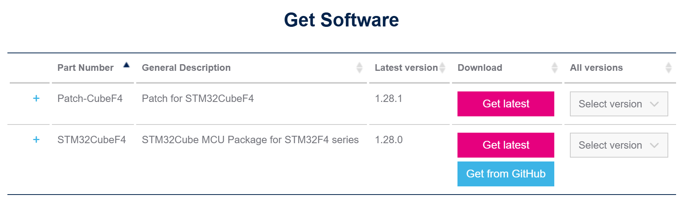

# Getting Started

# Required Programs/Tools

I am using the MCU STM32F411VET6  [Arm Keil | STMicroelectronics STM](https://www.keil.arm.com/devices/stmicroelectronics-stm32f411vetx/processors/)32F411VETx, that comes in a board: [32F411EDISCOVERY - Discovery kit with STM32F411VE MCU - STMicroelectronics](https://www.st.com/en/evaluation-tools/32f411ediscovery.html)

- For **STM32F411 Discovery Kit**, use [**STM32Cube Software tools suite](https://www.st.com/content/st_com/en/ecosystems/stm32cube-ecosystem.html)   with list here** [Getting started with STM32: STM32 step-by-step - stm32mcu](https://wiki.st.com/stm32mcu/wiki/Category:Getting_started_with_STM32_:_STM32_step_by_step)
    - [**STM32CubeMX**](https://www.st.com/en/development-tools/stm32cubemx.html) to configure STM32 microcontrollers. The package for the MCU will be downloaded up on prompt.
    - [**STM32CubeIDE](https://www.st.com/en/development-tools/stm32cubeide.html) t**o code/program.
    - [STM32CubeProg - STM32CubeProgrammer software](https://www.st.com/en/development-tools/stm32cubeprog.html)
    
    
    

Note that the above download returns zip file which we could extract and manually add appropriate header files to our projects. There are also sample projects for reference.

- Alternatively, download:
    - **uVision**
    - manually download and install packs for SMT32F4 series [Arm Keil | Keil STM32F4xx_](https://www.keil.arm.com/packs/stm32f4xx_dfp-keil/versions/)DFP. We should get a pack file that run installation upon clicked.

Note that the above download returns an installation file which can be imported to Keil uVision. CubeMX could also be used to configured the board and generate codes.

# Start Project

## using uVision:

1. Open uVision, go to Manager→Pack Installer to import library file for the MCU to KeilC. Choose appropriate chip, and package.
    
    
    
    1. Add main.c to Source Group folder: 
2. Open uViosn, new project → choose device. FOr example **STM**32F411VETx. Then select appropriate packet for the device..

1. Select packets:

1. A prompt to open CubeMX if we use CubeMX in Device: 

1. Normally, when first create, there is no **main.c** but only the library file. It is a good practice to change the name of Target_1 to the name of the microcontroller. Add main.c , import the appropriate header file and start coding.

4.1  If we use CubeMX, (by clicking Start CubMX, we configure the device with CubeMX and have it generate the code for us. It will place the files in a different folder as show in the message:

We can Open the Project with uVision, the following files were created. Note that we can go back CubeMX to change configuration, and re-generate the code. If we place our codes within the designate zone. it wont be lost. 

In addition, when we open the project from CubeMx or when we open the project from uVision directly, the project looks different, but they are basically the same project

## using STM32Cube tool

- Start My project from MCU → ACCESS TO MCU SELECTOR
- Select correct MCU, in my case: **STM32F411VET6**. We can double check by the inscription on the chip.

- Choose location. If there is prompt to download MCU package, then do it.
- Choose Toolchain/ IDE as STM32CudeIDE

- Open IDE and choose Open Project from File System. Notice the header files that are expanded.

# Create new project with SMT32CudeIDE:

- Create New Project —> in Target Selection choose correct board → Next → Input project Name and choose Options → Next

- the new project is open. The file .ioc will have the device configuration. Saving the file will modify main.c
- The PIn GPIO should be configured at this point.

- We can also configure the clock here (instead of programmatically)

- the project is created with the following file structure:

- Depending on the GPIO pin configuration and clocks config, we may have some function created for us:

# Flash the board

# Run

# Debug