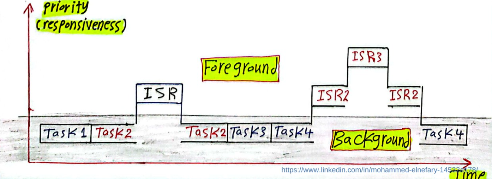

# Interrupt

# Concepts

- An interrupt is the call flow that stops the program in respond to an event. After the interrupt is handled, the program may go back to its previous operations.
    - in foreground/background architecture, the foreground consists of ISRs that handle async events. The ISRs are triggered by H.W interrupts pre-empt the execution of the background loop (main loop).
    
    
    
- There are several types of interrupt:
    - Hardware interrupt: triggers external hardware events. They include:
        - interrupts by communication peripherals SPI, I2C, UART,
        - timer interrupt which trigger events whenever there is time overflow,
        - interrupts by GPIO, triggered whenever there is change in input voltage at both falling or rising edge.
    - Software interrupt or programmable interrupts.

# Operations

1. Interrupt vector table: a table stored in a predefined memory location that contains addresses of Interrupt Service Routines (ISRs). Each entry in the IVT corresponds to a specific interrupt.
2. **NVIC** (Nested Vectored Interrupt Controller) manages the interrupts and handle them based on priority. Higher priority can “preempt” an interrupt with a lower priority, allowing it to be handled immediately even if the lower-priority interrupt is currently being serviced.
- Priority group: distinguishes preemption priority and sub-priority. The priority group is encodes as 4 bits value that are shared between preemption priority and sub-priority.
    - Pre-emption priority: main priority that may includes multiple sub-priority.


1. Processor Registers:
    - **Interrupt Vector Register**: Holds the address of the IVT.
    - **Program Counter (PC)**: Points to the next instruction to be executed.
    - **Stack Pointer (SP)**: Points to the top of the current stack.
    - **Status Register**: Contains flags that indicate the state of the processor.
2. How a program handles interrupt (basic scenario):
    1. **Interrupt Occurrence**: An interrupt is generated by an external device, software, or timer.
    2. **Processor Acknowledgement**: The processor acknowledges the interrupt and saves the current context (i.e., the current state of the program, including the Program Counter (PC) and Status Register) onto the stack.
    3. **Vector Fetching**: The processor fetches the interrupt vector from the IVT. This vector points to the address of the corresponding ISR.
    4. **Jump to ISR**: The processor loads the address of the ISR into the Program Counter (PC), effectively jumping to the ISR code.
    5. **ISR Execution**: The ISR executes, handling the interrupt event (e.g., reading data from an I/O device, processing a timer event).
    6. **Restore Context**: After the ISR completes, the processor restores the saved context from the stack, including the Program Counter (PC) and Status Register.
    7. **Resume Execution**: The processor resumes execution of the interrupted program at the point where it left off

# Implementation

## External interrupts:

- all interrupts must including the following configs.
- all interrupts must including interrupt handler whose name matches the interrupt vector.
    - Note: In STM32, interrupt handlers are generally defined using **specific function names** that correspond to the interrupt vectors. For other MCU, the provided compiler uses keyword `interrupt`

```c

// 1. clock config
void RCC_Config(){
	RCC_APB2PeriphClockCmd(approprate_clock, ENABLE);
}
// 2. port config
void GPIO_Config(){                                  
	GPIO_InitTypeDef GPIOInitStruct;
	// other configs
	GPIO_Init(GPIOA, &GPIOInitStruct);
}
// 3. interrupt line config
void EXTI_Config(){
	GPIO_InitTypeDef GPIOInitStruct;
	// other configs
	EXTI_Init(GPIOA, &GPIOInitStruct);
}
// 4. interrupt vector config
void Configure_NVIC(void) {
    // Configuration structure for NVIC
    NVIC_InitTypeDef NVIC_InitStruct;
    // Apply the configuration
    NVIC_Init(&NVIC_InitStruct);
}
// 5. interrupt handler
void EXTI0_IRQHandler()
{	
}
```

### **External interrupts on GPIO ports**

1. **Configuration codes for external interrupts on GPIO ports:**
- Enable both clock for GPIO pin and AFIO clock when:
    - **Using GPIO as External Interrupts**: If you are configuring GPIO pins to generate external interrupts, you often need to enable the AFIO clock.
    - **Peripheral Remapping**: When remapping peripherals (e.g., changing the default pin assignments for UART, SPI, etc.) to different GPIO pins.

```c
void RCC_Config(){
	RCC_APB2PeriphClockCmd(RCC_APB2Periph_GPIOA, ENABLE);
	RCC_APB2PeriphClockCmd(RCC_APB2Periph_AFIO, ENABLE);
	// other configs
}
```

- Configure interrupt on either rising edge of falling edge: interrupt happens at change in voltage input to GPIO. Furthermore, it happens at either increasing voltage or decreasing voltage event. It could be due to pressing or releasing a button.
- Other config for GPIO may be pin, speed.

```c
void GPIO_Config(){
	GPIO_InitTypeDef GPIOInitStruct;
	GPIOInitStruct.GPIO_Mode = GPIO_Mode_IPU;   // GPIO generates interrupt on rising edge
	GPIOInitStruct.GPIO_Pin  = GPIO_Pin_0;
	GPIOInitStruct.GPIO_Speed = GPIO_Speed_50MHz;
	// other configs
	GPIO_Init(GPIOA, &GPIOInitStruct);
}
```

- Map GPIO with EXTI lines. Normally GPIO ports are use to accept input data only. But to use it as interrupt, the GPIO port should be connected with corresponding 0 to 15 EXTI lines. Each EXTI line corresponds to a *specific* GPIO pin or a group of pins. These lines can be configured to trigger an interrupt on a rising edge, falling edge, or both.

```c
void EXTI_Config(){
	EXTI_InitTypeDef EXTIInitStruct;
  EXTIInitStruct.EXTI_Line = EXTI_Line0;                // EXTI_LINE should be suitable for GPIO_Pin
	EXTIInitStruct.EXTI_Mode = EXTI_Mode_Interrupt;       // The other mode is event, and should not be used
	EXTIInitStruct.EXTI_Trigger = EXTI_Trigger_Falling;   // Should match with GPIO_Mode
	EXTIInitStruct.EXTI_LineCmd = ENABLE;                 // Enable EXTI line
	EXTI_Init(&EXTIInitStruct);
}

```

- Configure priority

```c
void Configure_NVIC(void) {
    // Configuration structure for NVIC
    NVIC_InitTypeDef NVIC_InitStruct;

    NVIC_InitStruct.NVIC_IRQChannel = EXTI15_10_IRQn;          // configure priority for EXTI line.
    NVIC_InitStruct.NVIC_IRQChannelPreemptionPriority = 0x00;  // Preempt priority
    NVIC_InitStruct.NVIC_IRQChannelSubPriority = 0x00;         // Subpriority
    NVIC_InitStruct.NVIC_IRQChannelCmd = ENABLE;

    // Apply the configuration
    NVIC_Init(&NVIC_InitStruct);
}
```

1. **Handling Interrupt for GPIO ports**:
- EXTI lines are mapped to GPIO ports, the interrupts are handled by EXTI, thus we override the interrupt vector function:

```c
void EXTI0_IRQHandler()
{	
	if(EXTI_GetITStatus(EXTI_Line0) != RESET)   // check if the interrupt is from EXTI_0
		{
			// handling interrupt logic
		}
	EXTI_ClearITPendingBit(EXTI_Line0);         // reset interrup flag.
	}
}
```

- note that some compilers allows keyword `interrupt`  to specifically define interrupt function. [Interrupts in Embedded C for Microcontrollers-](https://www.learningaboutelectronics.com/Articles/Interrupts-embedded-C-for-micrcontrollers.php) Explained. Use the support tool provided by the microcontroller’s OEM.

### **External timer interrupt**

**Configuration for external timer interrupt**:

- Note that the timer interrupt event occurs when the counter reaches certain pre-programmed number.


- Configure timer: configure how much the counter increases to cause interrupt.

```c
void TIM_Config(){
  TIM_TimeBaseInitTypeDef TIM_TimeBaseInitStruct;
	TIM_TimeBaseInitStruct.TIM_Prescaler = 7200-1;              // increase step per 0.1 ms if clock speed if 72Mhz
	TIM_TimeBaseInitStruct.TIM_Period = 10-1;                   // counting from 0, overflow per 10 steps, or 1 ms, causing interrupt
	TIM_TimeBaseInitStruct.TIM_ClockDivision = TIM_CKD_DIV1;
	TIM_TimeBaseInitStruct.TIM_CounterMode = TIM_CounterMode_Up;
	TIM_TimeBaseInit(TIM2, &TIM_TimeBaseInitStruct);
	TIM_ITConfig(TIM2, TIM_IT_Update, ENABLE);     // timer interrupt enable
	TIM_Cmd(TIM2, ENABLE);
}
```

- Configure priority: same as above except `NVIC_InitStruct.NVIC_IRQChannel = TIM2_IRQn` . Note that in the same `Configure_NVIC`  we could configure multiple interrupt priority.
- Peripheral clock should be configured `RCC_APB2PeriphClockCmd(RCC_APB1Periph_TIM2, ENABLE)`

**Handling timer interrupt** by “overriding” interrupt vector function `TIM2_IRQHandler` 

### **External communication interrupt**

**Configuration for external communication interrupt**:

- for example, the following configures interrupt based on signal received at UART port

```c
void UART_Config(){
	USART_InitTypeDef UART_InitStruct;
	UART_InitStruct.USART_Mode = USART_Mode_Rx | USART_Mode_Tx;
	UART_InitStruct.USART_BaudRate = 9600;
	UART_InitStruct.USART_HardwareFlowControl = USART_HardwareFlowControl_None;
	UART_InitStruct.USART_WordLength = USART_WordLength_8b;
	UART_InitStruct.USART_StopBits = USART_StopBits_1;
	UART_InitStruct.USART_Parity = USART_Parity_No;

	USART_Init(USART1, &UART_InitStruct);
	USART_ITConfig(USART1, USART_IT_RXNE, ENABLE);     // timer interrupt enable for RX line on UART port
	USART_Cmd(USART1, ENABLE);
}
```

Handling external communication interrupt:

```c
void USART1_IRQHandler()    // the name of the function is predefined in the MCU header file in its library.
{
	uint8_t data = 0x00;
	if(USART_GetITStatus(USART1, USART_IT_RXNE) != RESET){
		while(USART_GetFlagStatus(USART1, USART_FLAG_RXNE));      // check if UART is receiving
			data = USART_ReceiveData(USART1);                       // receive data     
			if(USART_GetITStatus(USART1, USART_IT_TXE) == RESET){   // check if transmission line is open
				USART_SendData(USART1, data);                         // send data
				while (USART_GetFlagStatus(USART1, USART_FLAG_TC) == RESET);   // reset, exit
			}
	}
	USART_ClearITPendingBit (USART1, USART_IT_RXNE);
}
```

## Program interrupt

# Q/A:

1. What does program do when 2 interrupts with different priorities are invoked?

It depends on the scenarios: 

- if 2 interrupts arrive at the same time, none is handled yet: both will be handles in priority.
    
    
    
- if one lower priority interrupt is about to be handled while the higher priority arrived: the higher priority will be handled first, and the 6 cycle delays, and then the lower priority interrupt is handled.
    
    
    
- **if low priority interrupt arrives while the running interrupt is exiting**: after handling the  interrupt, SP will be restored before the lower priority interrupt is handled ⇒ longer delay.


1. What happen when timer interrupts is raise? 

Like all other interrupts, the program will: 

- based on the NVIC, the program will know what type of interrupt is raised.
- run logic defined in the interrupt handler function. The interrupt function is basically stored at the address where the NVIC interrupt pointer points to.
- clear the interrupt flags. The program will be hanged if the interrupt flag is not cleared in the interrupt handler function!!! The flag enables the program to exit the area where interrupt handler function is at.
- SP will returns to its status before the interrupt and execute the next instruction.