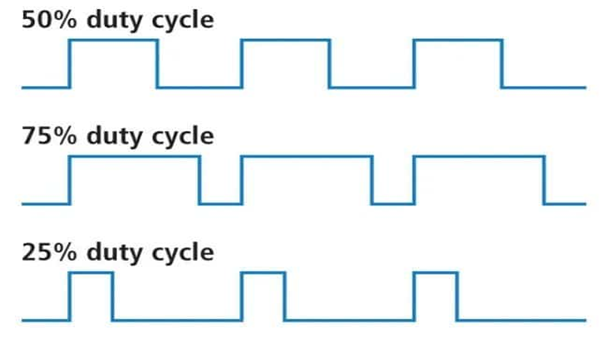

# PWM

# Concepts

**Pulse Width Modulator** adjust the duty cycle. 

Duty cycle is the the ratio of the pulse width compare to the cycle. 



Application is found in adjusting servo. Normally servo has certain frequency. Very low frequency may make servo vibrate, unstable. Very high frequency may not be supported by the servo. 

There is a relationship between the angular of a servo and the pulse width:


From required duty cycle, we could the find the time or pulse width. 

`pulseWidth = MIN_PULSE_WIDTH + (MAX_PULSE_WIDTH - MIN_PULSE_WIDTH) * angle / 180`

- **MIN_PULSE_WIDTH :** the pulse width for 0 degree.
- **MAX_PULSE_WIDTH :** the pulse width for 180 degree. ****

Timer could be user to create the expected pulse width. 

# Implementation

To use PWM, we have to config GPIO as `AF_PP` (push-pull alternative) and use GPIO with the timer channel.

- Config GPIO:

```c
void GPIO_Config(){
	GPIO_InitTypeDef GPIO_InitStructure;
	GPIO_InitStructure.GPIO_Pin = GPIO_Pin_0;              // PA0 là TIM2_CH1
	GPIO_InitStructure.GPIO_Mode = GPIO_Mode_AF_PP;        // Chế độ Alternate Function Push-Pull
	GPIO_InitStructure.GPIO_Speed = GPIO_Speed_50MHz;
	GPIO_Init(GPIOA, &GPIO_InitStructure);
}
```

- Config timer: The following configs timer such that a period of 20 ms, and pulse width of 1000 us is produced.
    - We increase the timer every 1ms ⇒ this is the pulse width.
    - We make the timer overflow each 20ms. ⇒ this is the period.


```c
void Timer_Config(){
	Timer_OCInitTypeDef Timer_OCInitStruct;
	Timer_OCInitStruct.Timer_OCMode =
	Timer_OCInitStruct.Timer_OuputState =
	Timer_OCInitStruct.Timer_Pulse =                          // the limit that timer compare to. If its value > limit => over flow, the the GPIO goes to low.
	Timer_OCInitStruct.Timer_OCPolarity = 
	
	TIM_OC1Init(TIM2, &Timer_OCInitStruct);
	TIM_OC1PreloadConfig(TIM2, TIM_OCPreload_Enable);
	TIM_Cmd(TIM2);
}
```

- Adjust the pulse width:

```c
TIM_SetComparex(TIMx, pulseWidth); 
```