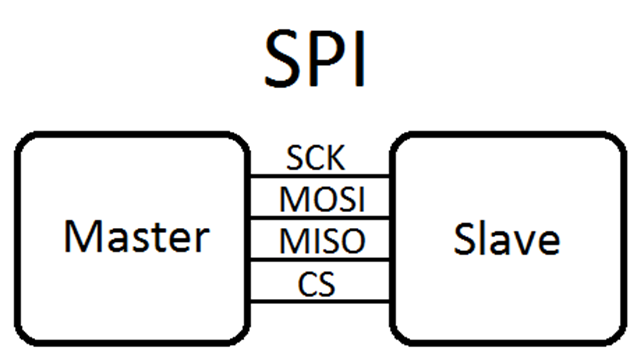
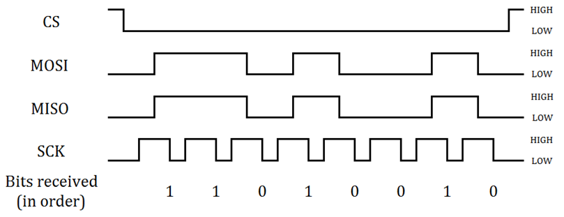

# SPI (Serial Peripheral Interface)

# Concept

- Series communication: a stream of input, 8 bit data type, are transmitted from Tx to Rx.
- Synchronized between Tx and Rx: meaning both will use the same clock, configured by the master via **SCK**
- Full duplex: RX and TX can be performed at the same time, each via a line.
- 1 Master can communicate to multiple Slaves
- 4 ports: **SCK, MISO, MOSI, SS or CS**
    - SCK has the clock signal that both slave/master will be used.
    - SS/CS indicates which slave that the master communicates to.



# Operations

1. **Start condition:** to configure Slave to send/receive data, CS is set to low for the Slave that is to receive data.
2. **Stop condition**: raise CS to stop communication.
3. **Synchronize bits between Master and Slave**: a single clock is provided by Master; 1 bit is transmitted per 1 period. Each bit is corresponding to period on SCK. 
4. **Data Sample mode**: 
    1. Clock Polarity **CPOL = 0** is corresponding to SCK=0 (clock idle) and **CPOL=1** is corresponding to SCK=1 (clock idles at high voltage), determines the idle state of the clock signal when no data is being transmitted.
    2. Clock Phase **CPA0 = 0** data is sample on the first edge. (either rising or falling, depending on CPOL). **CPHA = 1**: Data is sampled on the second edge (either rising or falling, depending on CPOL)

| **CPOL** | **CPHA** | **Clock idle state** | **Data sampled on** |
| --- | --- | --- | --- |
| 0 | 0 | Low | Rising Edge |
| 0 | 1 | Low | Falling Edge |
| 1 | 0 | High | Falling Edge |
| 1 | 1 | High | Rising Edge |
1. **Data format:** entire 8 bits are data bits.
2. **Basic Data Transmission**: 
    1. Data are left shifted and transmitted in series, bit by bit.
    2. Data are transmitted on 2 paths, and could be simultaneous. From Master to Slave on MOSI, and from Slave to Master on MISO.
    
    **Transmission**:
    
    - each SCK period allows transmission of 1 bit.
    - SCK voltage at idle mode determines CPOL. For example, SCK is high , then CPOL = 1 , data will be sampled at rising and falling edge of MISO and MOSI. If the  High signal on MISO lasts for 4 periods of SCK, the machine sample the signal at the rising edge and falling edge and knows that 4 bits have been transmitted.
    - CS goes to low will select the slave.
    - At the end of transmission, CS goes to high.
    
    **Receiving**:
    
    - a slave knows there is data transmitted to it by checking the CS line = high.
    - data comes on MOSI line at slave (or MISO at master) continuously ⇒ we have to implement logic to read the bits and shift it into a data structure.
    - the slave has to check for CS line all the time.



# Configuration and Implementation

I am using the **SMT32F4111 VET6 EDiscovery** board. [32F411EDISCOVERY - Discovery kit with STM32F411VE MCU - STMicroe](https://www.st.com/en/evaluation-tools/32f411ediscovery.html#overview)lectronics.

## **Configuration**:

### **1. Pinout & Configuration on  STM32CubeIDE**

- Note that the GPIO pins such as  `GPIO_PIN_4` are defined in STM32f4xx_hal_gpio.h file.  This action is peripheral remapping. If we want to use it as SPI CS port, we have to configure it. For coding clarity, we could define macro here:

```cpp
/* Private define ------------*/
/* USER CODE BEGIN PD */
#define SPI_CS_PIN GPIO_PIN_4
#define SPI_SCK_PIN GPIO_PIN_5
#define SPI_MISO_PIN GPIO_PIN_6
#define SPI_MOSI_PIN GPIO_PIN_7
/* USER CODE END PD */
```

Although the IDE could generate the code for us when we configure the GPIO ports, the relationship between GPIOA, and GPIO_PIN_x, the peripheral clock should be referred from the document. In the below, we see GPIO Port A is for PA[15:0].

If we want to use SPI1, our choice would be pin PA4, PA5, PA6, PA7 of the GPIO_A 


In addition, the table Pin Definition further explains the functionality of each pin. For example, we have the following for PA6. Using STM32Cube, we can also quickly gets the pin definition. 


### **2. GPIO configuration function: (peripheral remapping)**

`GPIO_InitTypeDef`  is the struct that defines the config for GPIO. 

- `Alternate`: specify the purpose of GPIO pin is using for communication purpose or any other purpose, in this case, it is used for SPI.
- `Mode`: identify the pins are used for input/output, or both.  The following indicates that 3 of the SPI ports are to be used for output,  while 1 MISO is used as input.

```cpp
static void MX_GPIO_Init(void)
{
  GPIO_InitTypeDef GPIO_InitStruct = {0};

  /*Configure GPIO pins : PA4 PA5 PA6 PA7 */
  /*SPI1 GPIO Configuration
    GPIO_PIN_4   ------> SPI2_NSS 
    GPIO_PIN_5   ------> SPI2_SCK 
    GPIO_PIN_6   ------> SPI2_MISO
    GPIO_PIN_7   ------> SPI2_MOSI
  */
  GPIO_InitStruct.Pin = SPI_CS_PIN | SPI_SCK_PIN | SPI_MOSI_PIN ;
  GPIO_InitStruct.Mode = GPIO_MODE_AF_PP;                               // output mode
  GPIO_InitStruct.Pull = GPIO_NOPULL;
  GPIO_InitStruct.Speed = GPIO_SPEED_FREQ_HIGH;
  GPIO_InitStruct.Alternate = GPIO_AF5_SPI1; 
  HAL_GPIO_Init(GPIOA, &GPIO_InitStruct);
  
  GPIO_InitStruct.Pin = SPI_MISO_PIN 
  GPIO_InitStruct.Mode = GPIO_MODE_AF_PP;      // alternate floating, undefined voltage            
  HAL_GPIO_Init(GPIOA, &GPIO_InitStruct);
}
```

### 3. Clock configuration

- We could use the open the file ioc which opens a tool to configure, enable/disable clocks. The Arm processor and all embedded peripherals inside the STM32 MCU receive one or several clocks generated by the RCC peripheral of the STM32. For SPI to work, we need to enable **APB peripheral clock**, **the system clock**.
    
    
    
- By default, HSI, the internal clock, is used as **system clock**. We could use the tool STM32CubeMX to generate the code for us, from the configuration input on a user interface like above.
- To use the GPIOA peripherals, we must enable the clock for the peripherals using the MACRO. We could enable our peripheral clock by using the macro.

```cpp
 __HAL_RCC_GPIOA_CLK_ENABLE();
```

- `__HAL_RCC_GPIOA_CLK_ENABLE`  is a macro that basically enables the clock for GPIOA. It is defined in stm32f4zz_hal_rcc.h file

```cpp
#define __HAL_RCC_GPIOA_CLK_ENABLE()   do { \
                                            __IO uint32_t tmpreg = 0x00U; \
                                            SET_BIT(RCC->AHB1ENR, RCC_AHB1ENR_GPIOAEN);\
                                            /* Delay after an RCC peripheral clock enabling */ \
                                            tmpreg = READ_BIT(RCC->AHB1ENR, RCC_AHB1ENR_GPIOAEN);\
                                            UNUSED(tmpreg); \
                                          } while(0U)
```

### 4. SPI Configuration/Init function

- We need to set the idle state and has someway to configure the speed of the transmission.
    - The idle state include the status of SCI, CS, MISO, MOSI at idle mode. The values are written directly to respective pins.
    - The SCK lines could be custom programmed by writing to SPI_SCK_PIN directly, follow by certain delay.
- **SCK clock** function:
    - We configure the SCK clock line with the following codes:
    
    ```cpp
    void Clock(){
    	 GPIO_WriteBit(SPI_GPIO, SPI_SCK_Pin, Bit_SET);
    	 delay_ms(4);
    	 GPIO_WriteBit(SPI_GPIO, SPI_SCK_Pin, Bit_RESET);
    	 delay_ms(4);
    }
    ```
    
- **SPI_init** function. the configure that starting state (idle state) that there is not data. In the following, we have
    - CS line must be high
    - SCK is high , to use CPOL = 1 , data will be sampled at rising and falling edge of MISO and MOSI.
    
    ```cpp
    static void SPI_Init(){
    	HAL_GPIO_WritePin(GPIOA, SPI_SCK_PIN, GPIO_PIN_RESET);
    	HAL_GPIO_WritePin(GPIOA, SPI_CS_PIN, GPIO_PIN_SET);
    	HAL_GPIO_WritePin(GPIOA, SPI_MISO_PIN, GPIO_PIN_RESET);
    	HAL_GPIO_WritePin(GPIOA, SPI_MOSI_PIN, GPIO_PIN_RESET);
    }
    ```
    
- STMCubeMX could generate the functions to set up both of the above in more concise code. `SPI_InitTypeDef` is the struct the stores all properties of SPI.
    
    ```cpp
    static void MX_SPI1_Init(void) {
    	SPI_HandleTypeDef hspi1; 
    	hspi1.Instance = SPI1; 
    	hspi1.Init.Mode = SPI_MODE_MASTER; 
    	hspi1.Init.Direction = SPI_DIRECTION_2LINES; 
    	hspi1.Init.DataSize = SPI_DATASIZE_8BIT; 
    	hspi1.Init.CLKPolarity = SPI_POLARITY_LOW; 
    	hspi1.Init.CLKPhase = SPI_PHASE_1EDGE; 
    	hspi1.Init.NSS = SPI_NSS_SOFT; 
    	hspi1.Init.BaudRatePrescaler = SPI_BAUDRATEPRESCALER_2; 
    	hspi1.Init.FirstBit = SPI_FIRSTBIT_MSB; 
    	hspi1.Init.TIMode = SPI_TIMODE_DISABLE; 
    	hspi1.Init.CRCCalculation = SPI_CRCCALCULATION_DISABLE; 
    	hspi1.Init.CRCPolynomial = 10; 
    	if (HAL_SPI_Init(&hspi1) != HAL_OK) { // Initialization Error Error_Handler(); 
    	}
    }
    ```
    

## **Transmission function**:

### Transmit function

- **transmit function at master side**
    - transmission starts when CS line is set to LOW..
    - each bit is transmitted by writing GPIO_PIN_SET or GPIO_PIN_WRITE to **MOSI port.** The bit is extracted from input data by bit masking and bit shift.
    - after each write, SCK clock sends a signal in full period.
    - At the end of transmission, set the SCK to High. Note that because we init the SPI such that data is sample on rising edge, and falling edge and that at idle state, the SCK signal is low, we want to invoke `SCK_Signal()` after writing to MOSI.
    
    ```cpp
    void SPI_Master_Transmit(uint8_t u8Data){
    	uint8_t u8Mask = 0x80; // 0b10000000
    	uint8_t tempData;
    	HAL_GPIO_WritePin(GPIOA, SPI_CS_PIN, GPIO_PIN_RESET);
    	delay_ms(1);
    	for(int i = 0; i < 8; i++){
    		tempData = u8Data & u8Mask;
    		if(tempData){
    			HAL_GPIO_WritePin(GPIOA, SPI_MOSI_PIN, GPIO_PIN_SET);
    			delay_ms(1);
    		} else{
    			HAL_GPIO_WritePin(GPIOA, SPI_MOSI_PIN, GPIO_PIN_RESET);
    			delay_ms(1);
    		}
    		u8Data = u8Data << 1;
    		SCK_Signal();
    	}
    	HAL_GPIO_WritePin(GPIOA, SPI_CS_PIN, GPIO_PIN_SET);
    	delay_ms(1);
    }
    ```
    
- **investigating the HAL function provided by STM**
    - the function runs same operations as we wrote. That is it raise the CS, MOSI port, and provides clock

### Receiving function

# Q&A

1. Advantages and Disadvantages of SPI:
- **Pros**
    - *Higher throughput than I²C. SPI speed could be 100 Mbps*
    - *Full duplex communication*
    - No start and stop bits, so the data can be streamed continuously without interruption.
- **Cons**
    - Only allows for a single master
    - No form of error checking like the parity bit in UART
    - Uses four wires (I2C and UARTs use two)
    - SPI is typically used for short-distance communication between devices
1. What are some common applications of SPI communication?
Some common applications of SPI communication include:
- Interfacing with sensors and other peripheral devices
- Communication with displays and other graphical output devices
- Memory and storage devices such as Flash memory and SD cards
- Audio and video processing
- Industrial control systems and automation
1. Concern when applying SPI? 
- EMI
1. How can we implement way to implement msg recorvery?