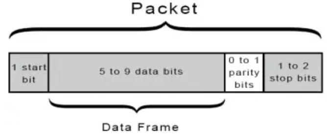

# UART (Universal Asynchronous Receiver-Transmitter)

# Concept

- Series communication
- Asynchronous: 2 devices don’t sync using the same clock. The TX and RX time will be preconfigure via baud rate (speed).
- Full Duplex
- No distinguish on master or slave. Only used in 1 to 1 communication. Since there is no clock synchronization, we don’t need a master to set the clock.
- Can configure the speed of the communication line
- Each device uses 2 ports Tx and Rx.

# Operations

1. **Configure to start/stop sending data**:
    - in idle mode: the voltage of Tx must be high.
    - at the start of transmission, Tx goes to low. Each device should have appropriate delay count for Tx port on each device to go from high to low.
2. **Synchronize bits reading between UART Transmitter and UART Receiver:**
    - both devices can operate on different clock speed, and uses their own timer. Thus configuring time synchronization between 2 devices with is not possible. For example a *delay count* 50, or *timer* = 50, could takes 0.005 ms for device A while taking 0.002 for deviceB.
    - Instead data transmission rate, ***baudrate*** is used. Ex: baud rate = 9600 means sending 9600 bits in 1000 ms. Thus, each devices can have the same expectation that 1 bit is to be transmitted per certain millisecond. Each device maintains its timer such that it can read the bits correctly. In order word, the device must know the appropriate *delay count* that it must take in order to read the next bit.
3. Data sample: 
    - there is no requirement to read of data bit on rising edge/falling edge of the clock because we don’t use clock synchronization in UART communication.
4. **Data format:**
    - data is transmitted as packets, including start bit, data bits, parity bits, stop bits. Data bits can be any from 5 to 9 bits. The parity bit value indicates if the number of data bits is even or odd, thus indicates to the Rx if the received data is good or bad.
    
    
    
    - most common UART data frame has 1 start bit, 8 data bits, 0 parity bit, 1 stop bit.
    - **Parity check**:
        - if the number of bit `1` in data bits is odd ⇒ parity bit must be `1`  so that total `1` bits is event
        - if the number of bit `1` in data bits is odd ⇒ parity bit must be `0` so that total `1` bits is odd
5. **Basic Data Transmission:** 
    - Data bus is sent to the Tx port in parallel:
    
    
    
    - UART adds starts bit, parity bits, and stop bit.
    
    
    
    - UART transmitter sends the whole packets to UART receiver in series. An agreed data speed (baud rate) must be preconfigured.
        - at this point, the since the data is sent in series, bit by bit, per certain milisecond that was preconfigured, we need to shift left the data bit and make appropriate delay count. The delay count on each devices is calculated from the clock speed of each device and the preconfigured baud rate.
    
    
    
    - receiving UART removes start bit, parity bits and stop bits.
    
    
    
    - receiving UART changes the data to parallel and sends it to data bus in parallel
    
    
    

# Configuration and Implementation

1. **Configuration**:
    
    sddsaf
    
    baud rate configuration
    
2. **Transmission function**:
3. **Receiving function**:
4. **Advance configuration**:

# Q&A

1. Advantages and Disadvantages of UART:
- **Cons**:
    - Short range communication
- **Pros**:
    - ***lower speed than SPI***. not suitable for time critical application.
    - asynchronous mode makes it slower.
1. how to we synchronize time between 2 devices?
    
    we programmatically reset the timer. Because of the reset, it causes slower traffic
    
2. what are the disadvantage of Bit Parity? Can we use check sum ?
3. Stop bit could be 1 or 2 bits, and depends on the device.  If we have discrepancies between 2 devices, what method we can do to deal with this situation? 
4. If stop bit supposed to be 2 bits, but the receiver only receive 1 bit, what can we do?