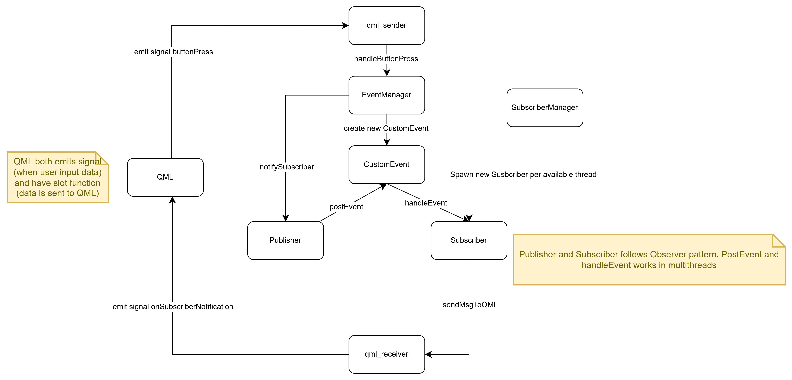

# Event_Driven_Messaging_System

# Introduction

# Architecture

## High Level Design

## Low Level Design

### Ownership management of  `subscriber` and `event`

- the client that uses the `Publisher` and `Subscriber` manages the lifecycle of the  `subscriber` and `event`.  In particular the main thread, the main function or GUI that create the `subscriber`  or `event`  will manage those items’ lifecycle.
- For flexibility the `std::shared_ptr`  is used as the container for `subscriber` and `event`.
- Since the `Publisher` doesn’t own or manage any instances of `Subscriber` , or `Event`,
    - pass by reference is used where an argument of `shared_ptr` is passed to any functions defined by `Publisher`
    - `Publisher`  manages a list of `Subscriber`  instances. The instances are `weak_ptr` .
    - `Publisher::unregisterSubscriber`  function doesn’t deallocate the heap mem containing Subscribers. The client, either GUI or main function that generates the subscriber have final ownership over the `subscriber` .
    - To avoid Lapse Listener Problem, the client should invoke `Publisher::unregisterSubscriber`  when exception happens or whenever the subscriber is removed.
    - `Publisher` must check if the `Subscriber` is alive before sending out messages.

# Applied QT Concepts

This sections briefly explains the QT concepts and APIs that are used in the program.

## QT Threads

## Events

- 3 types of events ard defined by QT [2]. In this program “posted events” type is used.
- when an event is *posted (posted events)*, via function `QCoreApplication::postEvent()`
    - QT adds the event and object receiver to an ***event queue*** and returns immediately. QT then handles the events in priority order and in its queue. The event handling result (`true/false`) is returned to main event loop via `QCoreApplication::notify` function. QT framework handles even processing on separate threads, thus  this provides asynchronous operations.
    - `QCoreApplication::notify` function is *implicitly* called by QT framework for all events sent to any object in any thread, but we could override them to deliver *groups of specific events,  such as extreme priority event,* to receiver object.
    - Event handling is done by overriding `QObject::event`  function for *each specific* event. This function should be overridden by the receiver object.
    - Custom event priority value type is integer but should be implemented via `enum QT::EventPriority`
- when event is *sent* via `QCoreApplication::sendEvent()` , it will be processed immediately. The operation is synchronous. This feature is not used in this program.

The following illustrates the usage of events in this program:

## Signal and Slot

- A signal is NOT a function; It doesn’t have implementation. It is emitted when a particular event occurs, and informed a changed in a private attribute of a class. A signal is defined with `signal` keyword.
    - `emit`  keyword:  is used to send a signal to and object that is connected to it by `QOject`
- A slot is a function, that is called in response to a particular signal. A slot is defined with `slot` keyword.
    - Note that as slots, they can be invoked by any component, regardless of its access level, via a signal-slot connection
- `QObject::connect` must be used to connect 2 instances of class that emits the signal and the class that handles the signal: `QObject::connect(emitterObject signal1, handlerObject slot2)`
- When a signal is emitted, the slots connected to it are usually executed immediately, just like a normal function call. This is synchronous operation.
- Compared to callbacks, signals and slots are slightly slower.

# References:

[1] [Signals & Slots | Qt Core 6.8.1](https://doc.qt.io/qt-6/signalsandslots.html)

[2] [Another Look at Events](https://doc.qt.io/archives/qq/qq11-events.html)