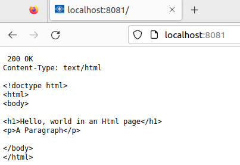
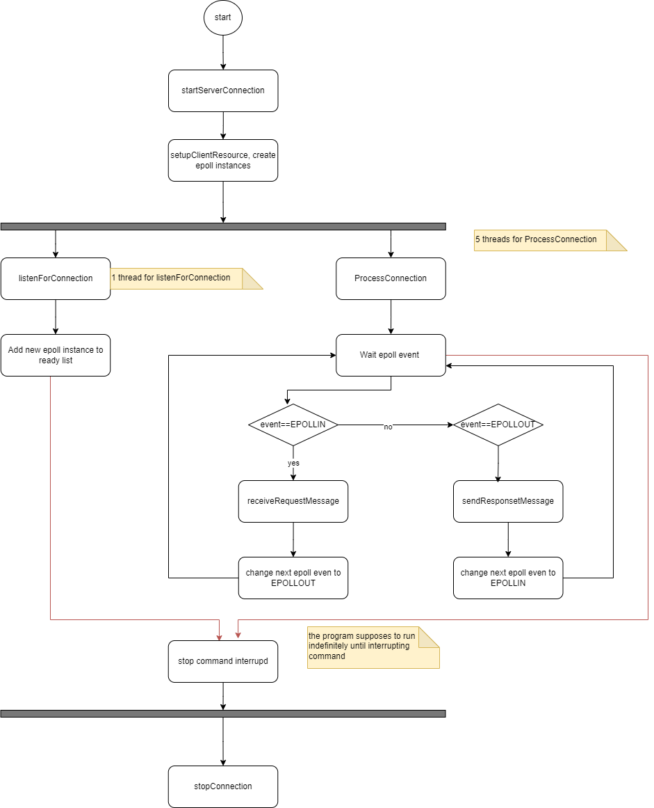

## Introduction
I was given a task to build a program, simulating a HTTP server in 5 days. A real HTTP server would have to service multiple request types and multiple clients. For each request types, the logic would be different to construct appropriate response. For a short time frame, I built this program to service only GET request. The response only returns a short XML text. 

## Running and Testing
Normally a webserver would employ service from Apache, Nginx, Microsoft Internet Information Services (IIS). For testing on local, I used `apache2`. To enable apache2 on Linux, the following steps are done: 
* install apache with the command on Terminal: `sudo apt-get install apache2`
* enable apache2: `sudo service apache2 restart`

To test this program with ONE client: 
* if I have a website, I could move the website files (html, css, js files) to `/var/www/html/`
* build the program with command at the program directory: `g++ main.cpp httpmessage.cpp httpserver.cpp -o main`
* run the program at the program directory: `./main`
* open the browser and access the url at: `http://localhost::8081`. **Note**: I specifically wrote the program to listen to port 8081 (not 8080). Thus to test this program, the url with 8081 must be used. 
* console output: 
* check the output on the browser. 

## Concepts
### HTTP
* HTTP  version 1.1 is defined by  RFC 7230, RFC 7231, RFC 7232, RFC 7233, RFC 7234, RFC 7235.
* RFC 7230 defines the following: 
  * request message by clients that contains method (message type such as GET, POST), URI (path to the requested resources), http version, subsequent header fields,  an empty line to indicate the end of the header section, and finally a message body containing the payload body.
  * sample message: 
```
GET / HTTP/1.1
Host: localhost:8081
User-Agent: Mozilla/5.0 (X11; Ubuntu; Linux x86_64; rv:109.0) Gecko/20100101 Firefox/113.0
Accept: text/html,application/xhtml+xml,application/xml;q=0.9,image/avif,image/webp,
Accept-Language: en-US,en;q=0.5
Accept-Encoding: gzip, deflate,
```
* The most important part of the HTTP request message is the headline. For example: `GET / HTTP/1.1`. We parse the line to get http method, requested uri, and http servion.

### TCP sockets programing
* TCP socket could be used to connect webserver and clients (browsers) and receive/send http messages. 
* The TCP socket are identified by address and ports. For local testing, the port number is 8080 or 8081. For real HTTP server, the port is 80.
* The socket operations that needed to be configured and perform are: `socket` , `bind`, `accept` or `accept2`, `listen`, `recv`, `send`
* non-blocking I/O options should be used.


### Servicing multiple clients:
* we could use `epoll` and `epoll_ctrl` to manage the list of client socket file descriptor.
* we could use thread pool to manage the threads, each of which serves a single client connection. 



## Implementation Detail
* HTTP service single client: https://github.com/mnpham2101/Projects/tree/main/minhHttpServer
* HTTP service multiple clients: to be complete
  
### Program architecture
The following defines the class that constructs HTTP messages.


### TCP Socket programming
According https://developer.mozilla.org/en-US/docs/Web/HTTP/Session, a typical HTTP session requires TCP socket connection established. The socket is identified by: IP address and port. 
* IP address: using Linux API, we initiate a server socket with `sockaddr_in` data.
```
struct sockaddr_in {
    sa_family_t    sin_family; /* address family: AF_INET for IPv4*/
    in_port_t      sin_port;   /* port in network byte order */
    struct in_addr sin_addr;   /* internet address */
};
/* Internet address */
struct in_addr {
    uint32_t       s_addr;     /* address in network byte order */
};

```

* Port: we use integer data type and the Linux API to convert to `in_port_t` : `hton(port)`

The server and clients perform those operations to establish connections and send data: 
* start server: supported by `socket` and `bind` function:
  ```
  int serverSocket;
  serverSocket = socket(AF_INET, socket_type, protocol)
  bind(serverSocket, reinterpret_cast<sockaddr*>(&serverAddress), sizeof(serverAddress))
  ```
  **Note**: the `socket_type` can be used are `SOCK_STREAM` and `SOCK_NONBLOCK`.
    * `SOCK_STREAM`: according Linux Man page, it provides sequenced, reliable, two-way, connection-based byte streams.
    * `SOCK_NONBLOCK`: Socket operations, such as read(), write(), and connect(), do not block the calling thread. In addition, non-blocking sockets allow for asynchronous I/O (input/output). This means that you can initiate an operation, such as a read or write, and continue executing other tasks while waiting for the operation to complete.
  
* listen for connection: the server should run continously and listen for any connection from clients.   
  ```
  listen(serverSocket, backlog)
  ```
  backlog is the integer value that defines the maximum length to which the queue of pending connections for serverSocket my grow.

* receive client's connection: Linux API supports `accept` and `accept4`
  ```
  int clientSocket;
  sockaddr_in clientAddress{};
  socklen_t clientAddressSize = sizeof(clientAddress);
  clientSocket = accept(serverSocket, reinterpret_cast<sockaddr*>(&clientAddress), &clientAddressSize);
  ```
  **Note**: 
    * the `serverSocket` is the file descriptor returned by `socket` function above.
    * `accept4` defines an extra integer parameter `flag`. There are 2 values `SOCK_NONBLOCK` and `SOCK_CLOEXEC`
      * `SOCK_NONBLOCK` according to Linux Manpage it sets the `O_NONBLOCK` file status flag on the new open file description. If a file descriptor operated in non-blocking mode, neither the open() nor any subsequent I/O operations on the file descriptor which is returned will cause the calling process to wait. This feature only works on supporting devices.
* read client's data
    * The data from client is read from server side, using `recv` function:
    ```
    char buffer[30000];
    memset(buffer, 0, sizeof(buffer));
    ssize_t bytesRead = recv(clientSocket, buffer, sizeof(buffer) - 1, 0);
    ```
    * The full HTTP message is stored into the buffer char array. 
    * I define `parseRequest(std::string(buffer))` to extract information from the HTTP data. The most important information that I need to get from the HTTP message is on the first line. The first line is a substring, defined by the left position and right position. The right position is found by the end of the line, defined by `\r\n` (Carriage return and line feed) characters.
    ```
    rpos = request_string.find("\r\n", lpos);
    start_line = request_string.substr(lpos, rpos - lpos);
    ```
    * The start line has the following format: `httpMethod path httpVersion`. The 3 fields are separated by space. Thus those fields could be read simply by `<<` operator.
    ```
    stringstream iss;
    iss.str(start_line);
    iss >> httpMethod >> path >> httpVersion;
    ```
* send response to client
    * For this program, I return a simple XML text. A real HTTP server however has to retrieve the resouces from the path, requested by the clients. I found this github that gives very simple implementation for GET response: https://github.com/Dungyichao/http_server
    * The data are sent back to client using `send` func tion:
    ```
    // Send a response back to the client
    std::string response = httpResponse->constructResponseString(*httpResponse, true);
    // const char* response = "Server received your message!";
    ssize_t bytesSent = send(clientSocket, response.c_str(), strlen(response.c_str()), 0);
    ```
* close connection

### Servicing multiple clients:
I made the first version of the program to service 1 client. The program runs 1 times: after the server response to clients, the server shuts down and closes all connections. https://github.com/mnpham2101/Projects/tree/main/minhHttpServer

Next version will implement service for multiple clients. In other to do that, a few designs as below are considered: 

#### Non blocking I/O: 
Linux supports non-blocking I/O on compatible devides. It is implemented with `socket_type = SOCK_NONBLOCK` are used. As mentioned above, SOCK_NONBLOCK allows reading/writing to socket simultaneously; the writing thread/process won't block the reading thread/process.

Therefore the following function calls are needed modifications:
```
int serverSocket;
serverSocket = socket(AF_INET, SOCK_STREAM | SOCK_NONBLOCK, 0);

int clientSocket;
sockaddr_in clientAddress{};
socklen_t clientAddressSize = sizeof(clientAddress);
clientSocket = accept4(serverSocket, reinterpret_cast<sockaddr*>(&clientAddress), &clientAddressSize,SOCK_NONBLOCK);
```

#### Using EPOLL:
* epoll instance allows managing the file system that are awaiting read/write. In our cases, the file system are the `clientSocket` file descriptor returned by `accept4` function above. The epoll instance itself is a file descriptor to be used in `epoll_ctrl` function.  

* `epoll_ctrl` function is used to add, modify, or remove entries in the interest list of the epoll, refered by the file descript `epollFd`. The operation type add, modify, delete are refered by the parameter `op`. 
```
epoll_ctl(int epollFd, int op, int fd, struct epoll_event *event)
```
* the epoll_event has the following info: 
```
typedef union epoll_data {
    void        *ptr;
    int          fd;         /* file descriptor*/
    uint32_t     u32;
    uint64_t     u64;
} epoll_data_t;

struct epoll_event {
    uint32_t     events;      /* Epoll events */
    epoll_data_t data;        /* User data variable */
};
```
* **Note**: the `epoll_data` struct defines the file descriptor of writing/reading operation. When server reads client's data, we assign the `clientSocket` file descriptor returned by `accept4` to this epoll_data member `fd`. Accordingly, we also have to define `events = EPOLLIN` in `epoll_event`. When server sends client's data, we assign the `serverSocket` file descriptor to `fd`, and use `events = EPOLLIN`
* **Note**: the void pointer `ptr` of epoll_data should point to the data content in the response from the server to client. In our project, I define httpResponse class that stores that data to be sent back to client. 

```
// httpResponse is created by server logic based on httpRequest
// Send a response back to the client
std::string response = httpResponse->constructResponseString(*httpResponse, true);
ssize_t bytesSent = send(clientSocket, response.c_str(), strlen(response.c_str()), 0);
// add the epoll and httpResponse to epoll:
epoll_event epoll_data_response;
epoll_data_response.events = EPOLL_CTL_ADD;
epoll_data_response.data.ptr = httpResponse;
epoll_ctl(epoll_fd, EPOLLOUT, clientSocket, &epoll_data_response)      // epoll_data_response should includes httpResponse data in its member *ptr
```

### Managing multiple threads
* Each client request could be handled by a single thread. The following actions are performed: 
  * create an epoll instance `epoll_fd`.  
  * create httpResponse
  * send the response to client.
  * add `clientSocket` file descriptor to epoll instance using `epoll_ctrl`
* I intend to create a thread pool to manage the threads that serves each client. The thread pool could make use of `mutex` and `conditional_variable`. In another project, I implemented a primitive thread pool: https://freewindcode.com/2023/05/12/concurrency-programming-runthread-pool-with-c-and-kotlin/#Primitive_thread_pool_with_mutex_and_conditional_variables 


## References

I found the following resources to be tremendously helpful:

* This github resource has simple codes, under 500 lines total. The codes has simple logic to parse and returns all GET requests. The http response message and return not only html but jpeg, css, js files as requested by client. As the result, a full functioning website could be displayed. https://github.com/Dungyichao/http_server

* This blog explains how the server can employ various methods to serve multiple clients: https://trungams.github.io/2020-08-23-a-simple-http-server-from-scratch/ 